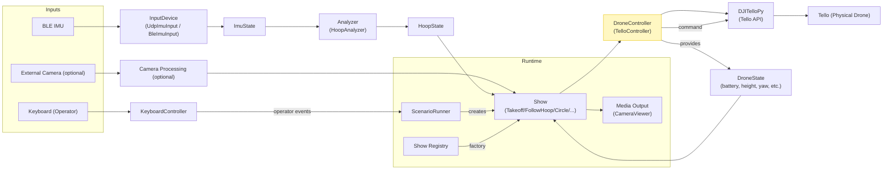

# システム図（実機：DJI Tello を使用）

以下は本プロジェクトを実機ドローン（DJI Tello）で運用する場合のシステム図です。
Mock 系のコンポーネントは含めていません。

## 概要

- 入力: BLE IMU、キーボード（オペレータ）、外部カメラ（任意）
- センシング→解析→演出→ドローン制御 の流れで構成
- DroneController は `TelloController` を想定し、内部で `DJITelloPy` を利用する

---

## 図（Mermaid）

---

## コンポーネント説明（簡易）

- InputDevice: BLE経由のIMUを受け取り `ImuState` を生成する。例: `src/inputs/imu/udp_imu_input.py`。
- Analyzer: `ImuState` を解析して `HoopState` を生成する。例: `src/analyzers/hoop_analyzer.py`。
- Show: 演出ロジック。`DroneController` を通じてドローンを制御する（直接 DJITelloPy を呼ばない）。例: `src/shows/*`。
- DroneController (TelloController): `DJITelloPy` を内包し、接続・状態監視・コマンド排他（Command Lock）を扱う。例: `src/controllers/drone/tello_controller.py`。
- DJITelloPy: 実機Telloとの橋渡しを行うライブラリ（外部依存）。
- ScenarioRunner: シナリオ管理・Show 切替・オペレータコマンド処理を担当。例: `src/runtime/scenario_runner.py`。
- Registry: Show 名からインスタンスを生成するファクトリ（`src/registry/show_registry.py`）。
- CameraViewer / Media Output: Show の可視化出力（オプション）。

---

## 備考

- 本図は実機運用を前提とし、Mock 系 (`MockDroneController`) は含めていません。
- 実運用時は `TelloController` の接続や例外（接続障害、タイムアウト等）を ScenarioRunner 側で適切に扱ってください。
- ファイル: [docs/system_diagram.md](docs/system_diagram.md)
